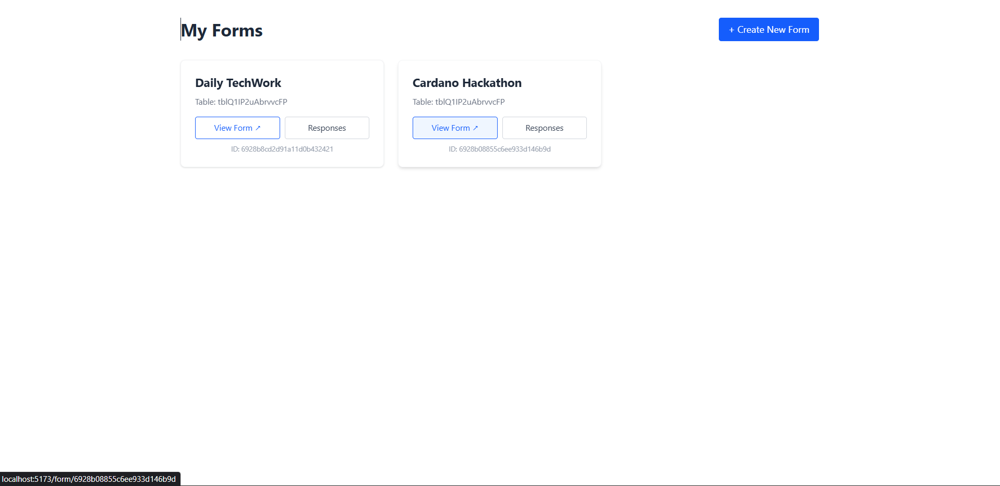
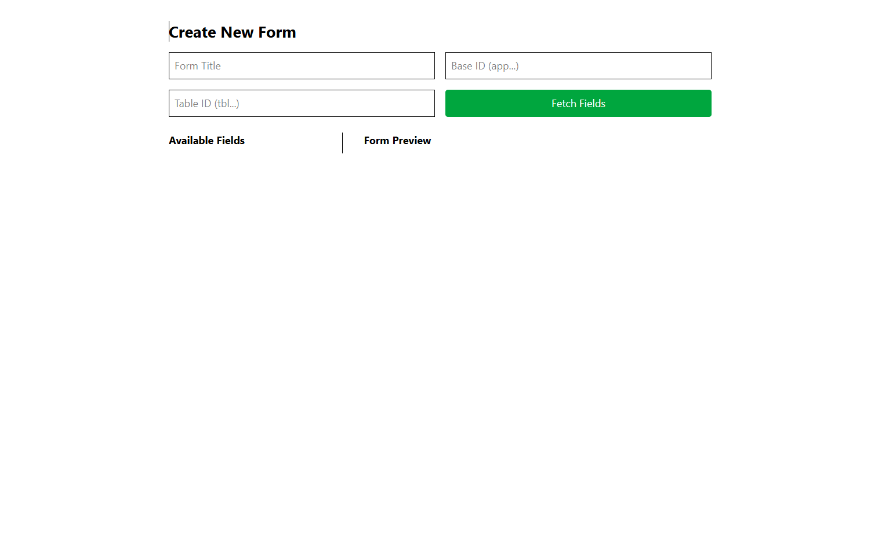
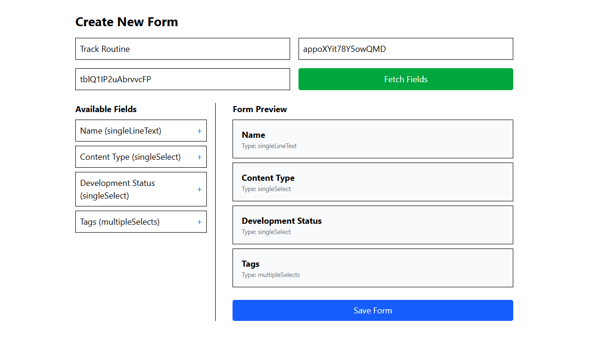
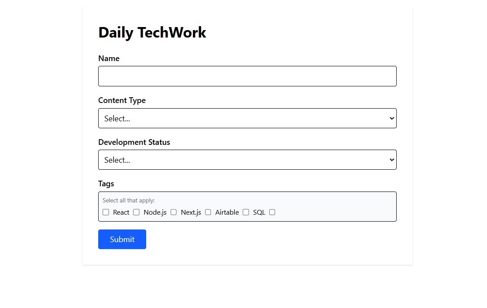
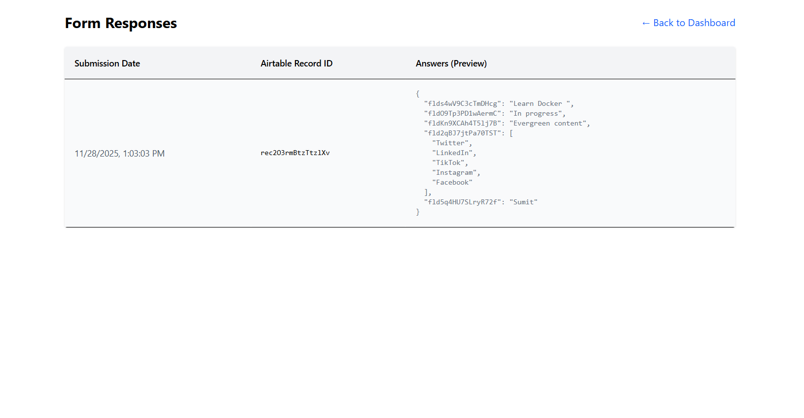

Airtable-Connected Dynamic Form Builder
A full-stack MERN application that allows users to create custom forms based on their Airtable schemas, apply conditional logic, and sync responses between MongoDB and Airtable in real-time.

## 🚀 Features
Airtable OAuth Integration: Secure login using Airtable's OAuth 2.0 with PKCE.

Dynamic Form Builder: Fetch tables and fields from Airtable to build custom forms.

Conditional Logic Engine: Apply "Show/Hide" rules to questions based on user input.

Dual-Database Sync: Responses are saved to both MongoDB (for reliability) and Airtable (for user management).

Real-time Webhooks: Updates or deletions in Airtable are automatically synced to the local database.

🛠 Tech Stack
Frontend: React (Vite), Tailwind CSS, React Router, Axios

Backend: Node.js, Express.js

Database: MongoDB (Mongoose)

## External API: Airtable REST API & Webhooks

### ⚙️ Setup Instructions

Prerequisites: 

Node.js (v16+)
MongoDB installed locally or a MongoDB Atlas URI
Airtable Account

1. Clone the Repository
git clone https://github.com/Sumits-Cosmos/Dynamic-Form-Builder.git
cd Dynamic-Form-Builder

2. Backend Setup
cd Backend
npm install

Create a .env file in the Backend folder:
PORT=8080
MONGO_URI=mongodb://localhost:27017/airtable_form_builder
JWT_SECRET=your_super_secret_key_here

## Airtable Configuration
AIRTABLE_CLIENT_ID=your_client_id_from_airtable
AIRTABLE_CLIENT_SECRET=your_client_secret_from_airtable
AIRTABLE_REDIRECT_URI=http://localhost:5173/callback

### Start the backend:
npx nodemon

3. Frontend Setup

cd frontend
npm install

Create a .env file in the Frontend folder:
VITE_API_URL=http://localhost:8080/api
VITE_AIRTABLE_CLIENT_ID=your_client_id_from_airtable
VITE_AIRTABLE_REDIRECT_URI=http://localhost:5173/callback

### Start the frontend:
npm run dev

## 🔑 Airtable OAuth Setup Guide

To make the login work, you must register an integration in Airtable:

Go to Airtable Builder.

Click Create new OAuth integration.

Name: Your App Name (e.g., "Dynamic Form App").

Redirect URI: Enter http://localhost:5173/callback exactly.

OAuth Scopes: You must add these 4 scopes manually:

data.records:read

data.records:write

schema.bases:read

user.email:read

Click Save.

Copy the Client ID and Client Secret into your .env files as shown above.

## 📂 Data Model Explanation

The application uses three main Mongoose schemas:

1. User
Stores authentication details to maintain the session.

airtableId: Unique ID from Airtable.

accessToken & refreshToken: Used to make API requests on behalf of the user.

2. Form
Defines the structure of a created form.

questions: Array of field definitions (label, type, required status).

conditionalRules: Logic rules for each question (see below).

airtableBaseId & airtableTableId: Links the form to a specific Airtable location.

3. Response
Stores the actual submission data.

answers: JSON object containing user input.

airtableRecordId: Reference to the created row in Airtable.

deletedInAirtable: Boolean flag set by webhooks if data is removed from Airtable.

## Conditional Logic Explanation

The app implements a custom logic engine that runs on both the Frontend (for real-time UI) and Backend (for security validation).

Structure: Every question can have a conditionalRules object:

JSON

{
  "logic": "AND", // or "OR"
  "conditions": [
    {
      "questionKey": "field_123",
      "operator": "equals", // "notEquals", "contains"
      "value": "Engineer"
    }
  ]
}
Pure Function: A utility function shouldShowQuestion(rules, answers) evaluates these rules.

It checks the answer to the referenced questionKey.

It compares it against the value using the operator.

It combines multiple conditions using the logic operator (AND/OR).

## Webhook Configuration (Sync)

To keep the local database in sync when data is changed directly in Airtable:

The backend exposes an endpoint: POST /api/webhooks/airtable.

When a form is created, you can register a webhook in Airtable (script/manual setup required for this demo scope) pointing to your server URL.

Events Handled:

Update: If a record is edited in Airtable, the MongoDB answers field updates.

Delete: If a record is deleted in Airtable, the MongoDB record is marked deletedInAirtable: true (Soft Delete).

## Demo 
[Demo Video](https://drive.google.com/file/d/1MNbYAjO4tgCXY0nNk1WZUzfiyjCer23I/view?usp=sharing)
### Screenshots 

🏃‍♂️ How to Run
Ensure MongoDB is running.

Open Terminal 1: cd Backend && npx nodemon (Runs on port 8080).

Open Terminal 2: cd Frontend && npm run dev (Runs on port 5173).

Open browser to http://localhost:5173.

## Deployment URL's
Backend: https://dynamic-form-builder-2l40.onrender.com
Frontend: https://dynamic-form-builder-34o3zc8vl-sumit-rajs-projects-68298abe.vercel.app/

### After Login
Try to give this to make a form:
Form Name: Whatever You Like
Bases ID: app43hcP50D2ui3Ft
Tables ID: tblXKPRWFCLw5pVSt

### Critical
If you get some error while visiting the web app:
Wait for 50sec and then try again immediately, Happens because of using Render's Free Tier.
When Backend isn't used for a while, Render puts it to "sleep."